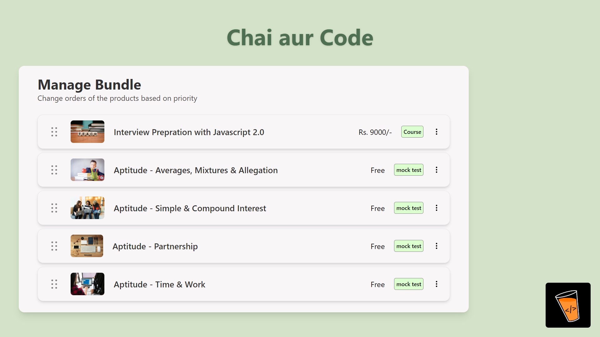
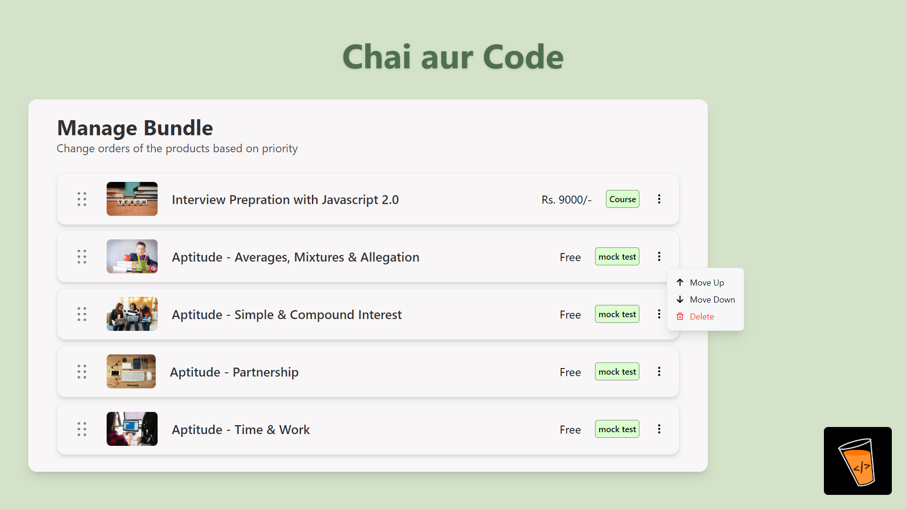
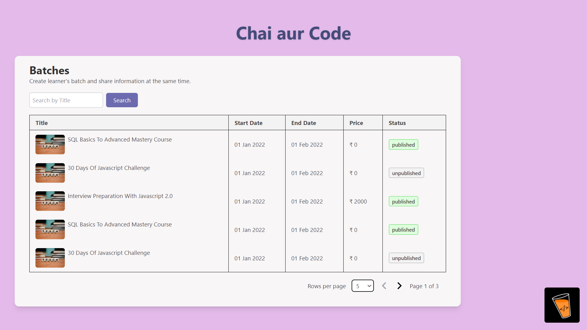
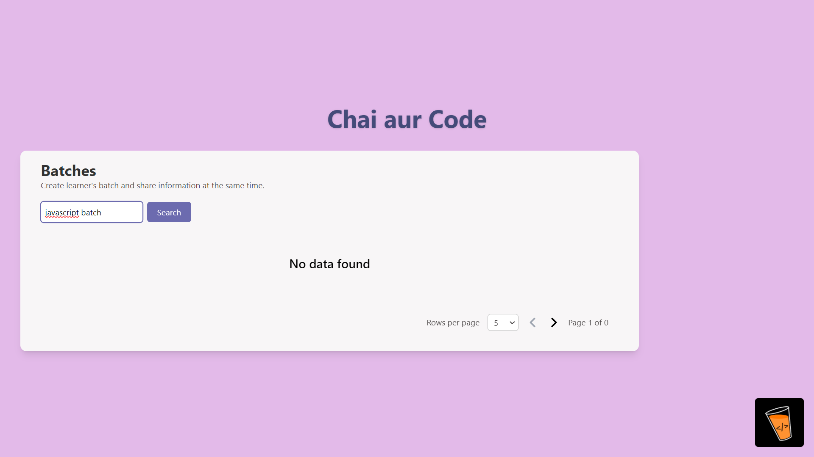

# MasterJi's Assignment

This repository contains the solution for the assignment given by Hitesh Choudhary on the [masterji](https://masterji.co) platform. The assignment involves creating three tasks using React: an OTP form, a drag-and-drop course card list, and a data table for batches.

## Tasks

1. **OTP Form**
   - Empty Form State: A form to input a 4-digit OTP
   - Filling State: The state during the input of the OTP
   - Filled State (Success): The state when the OTP is correctly filled
   - Filled State (Error): The state when the OTP is incorrectly filled

2. **Drag and Drop Course Cards**
   - Implement a list of vertical course cards using a drag-and-drop library
   - Each card should have actions for "Move to Top," "Move to Bottom," and "Remove"

3. **Data Table**
   - Create a paginated table listing batches of a course and their statuses
   - Include a search option to filter the batches

## Screenshots

### OTP Form


### Course List




### Batches 





## Additional Requirements

- All three assignments are completed inside a single React project
- Each task has its own URL route:
  - `/otp-form`
  - `/course-list`
  - `/batches`
- The base URL `/` redirects to the first task route `/otp-form`
- The branding logo is positioned in the bottom right corner for all tasks
- Clicking the logo opens the "chaicode.com" website
- The React code precisely matches the provided Figma designs

## Technologies Used

- React
- React Router
- Tailwind CSS for styling

## Installation and Setup

### Clone the Repository

1. Clone the repository:
   ```bash
   git clone https://github.com/SatishK2022/MasterJi-Assignments.git
   ```

2. Navigate to the project directory:
   ```bash
   cd MasterJi-Assignments/Assignment-1
   ```

### Install Dependencies

3. Install the required dependencies:
   ```bash
   npm install
   ```

### Install Tailwind CSS

4. Install Tailwind CSS and its peer dependencies via npm:
   ```bash
   npm install -D tailwindcss postcss autoprefixer
   ```

5. Generate the Tailwind configuration files:
   ```bash
   npx tailwindcss init -p
   ```

6. Configure your `tailwind.config.js` file to include your template paths:
   ```javascript
   module.exports = {
     content: [
       "./src/**/*.{js,jsx,ts,tsx}", // Adjust this path as needed
     ],
     theme: {
       extend: {},
     },
     plugins: [],
   }
   ```

7. Add the Tailwind directives to your CSS file (e.g., `src/index.css`):
   ```css
   @tailwind base;
   @tailwind components;
   @tailwind utilities;
   ```

### Start the Development Server

8. Start the development server:
   ```bash
   npm run dev
   ```

9. Open your browser and visit `http://localhost:5173` to see the application.

## Deployment

The application is deployed on Vercel and can be accessed at [https://master-ji-assignment1.vercel.app/](https://master-ji-assignment1.vercel.app/).

## Conclusion

This assignment demonstrates the ability to create a multi-page React application with various features like an OTP form, drag-and-drop functionality, and a data table. The code follows best practices and adheres to the provided design guidelines.